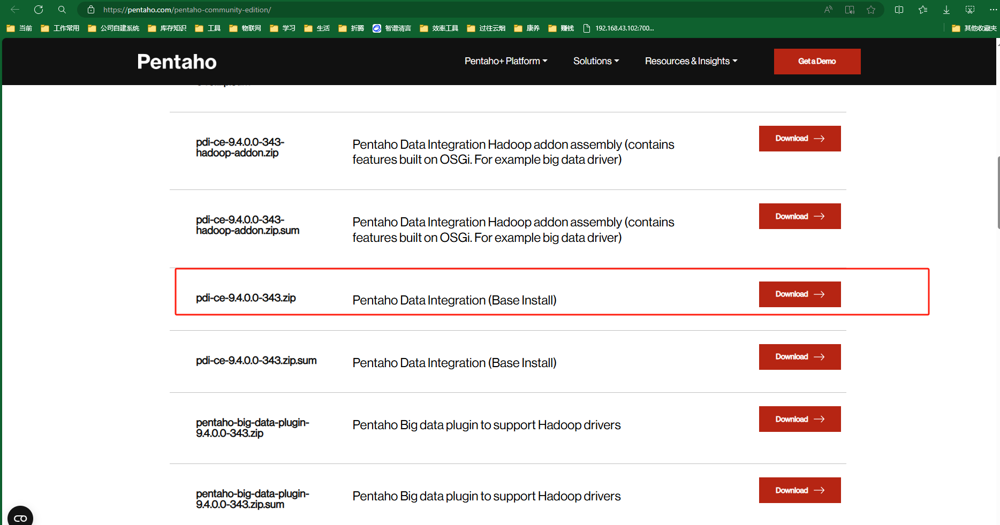
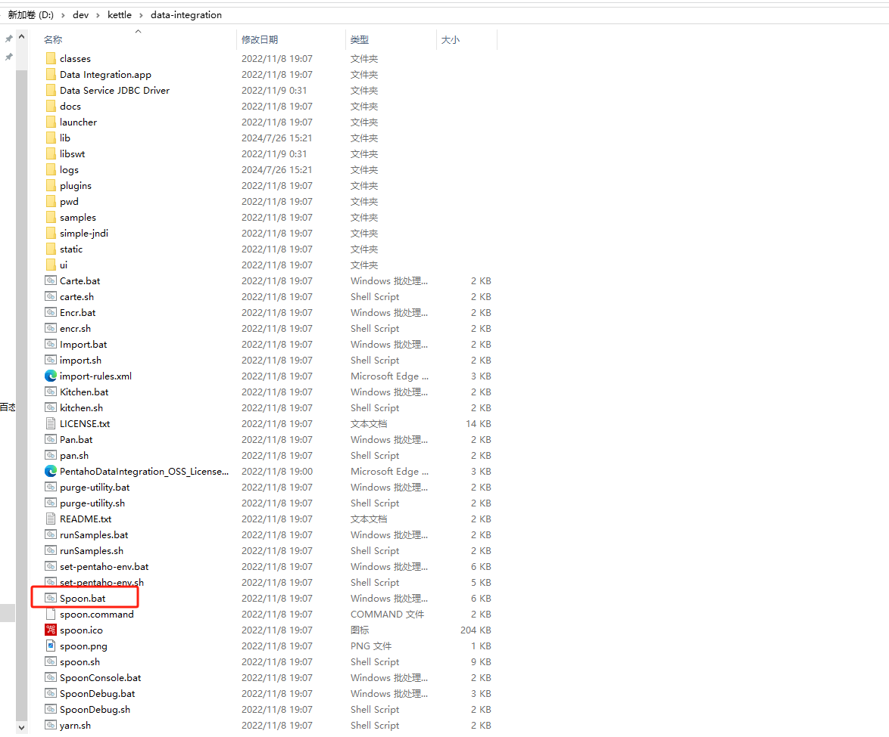
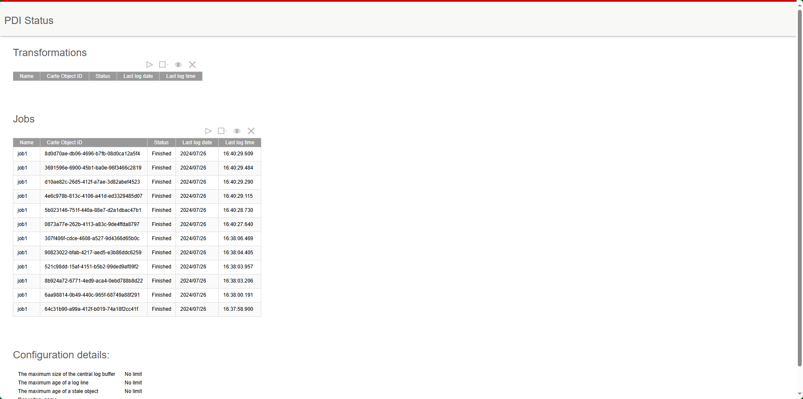
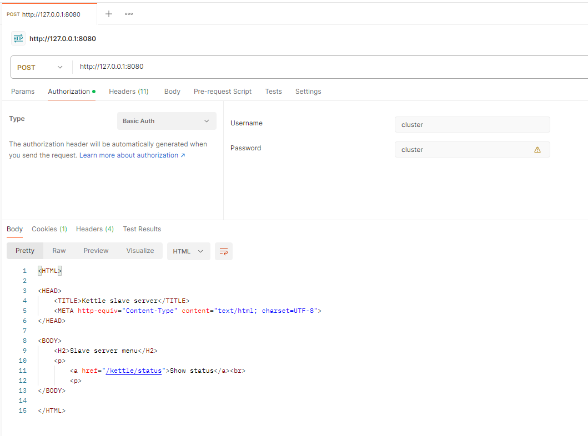
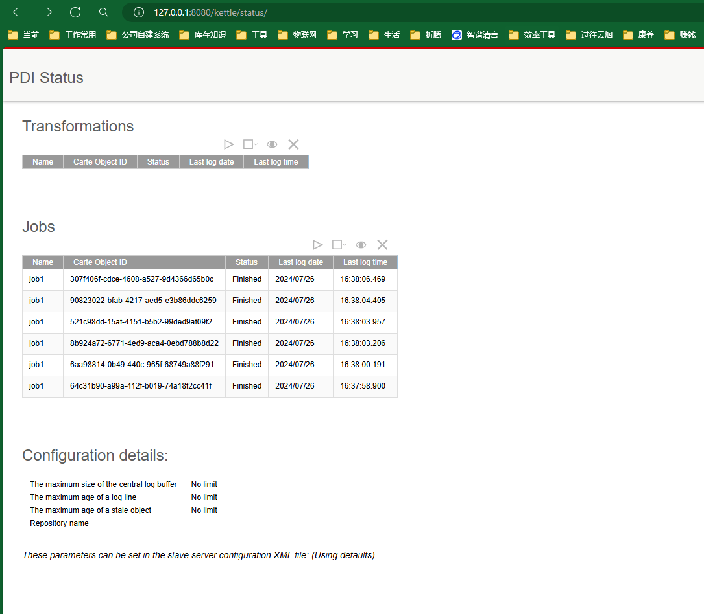

# 前言
- kettle已经更名为pdi， 所以在官网下载 pdi-ce 客户端，
- 当前版本为 9.4
- 开源地址：https://github.com/pentaho/pentaho-kettle
- 下载地址为：https://www.hitachivantara.com/en-us/products/pentaho-platform/data-integration-analytics/pentaho-community-edition.html
- 直链下载(2024年8月更新)：https://privatefilesbucket-community-edition.s3.us-west-2.amazonaws.com/9.4.0.0-343/ce/client-tools/pdi-ce-9.4.0.0-343.zip
-

# 默认不带数据库驱动
可下载驱动后放到lib目录中
- mysql驱动下载： https://repo1.maven.org/maven2/com/mysql/mysql-connector-j/


# 设计器 Spoon

解压文件


点击Spoon.bat启动设计界面

# 存储仓库
界面右上角，connect处管理

简单新建一个文件存储库

配置文件会修改 C:\Users\abc\.kettle

# 服务接口 Carte
Carte.bat 为服务端程序， windows下可修改 Carte.bat, 在前面增加一行代码，防止乱码清空出现
```
set OPT= -Dfile.encoding=utf-8
```
需命令行启动： 
- Carte 127.0.0.1 8080 
- Carte 127.0.0.1 8080 -s -u cluster -p cluster

使用的Basic认证， 默认账号密码都是 cluster

可通过浏览器访问看看是否启动成功
http://127.0.0.1:8080/kettle/status/



使用postman测试



参考：https://blog.csdn.net/Octopus21/article/details/115518944


# 接口
网上资料太少

## 提交作业 executeJob


http://127.0.0.1:8080/kettle/executeJob/?rep=test-repo&user=cluster&pass=cluster&job=job1

可通过页面查看结果 http://127.0.0.1:8080/kettle/status/


## 其他接口
可参考源码 engine/src/main/resources/kettle-servlets.xml

```xml
<?xml version="1.0" encoding="UTF-8"?>
<servlets>

    <!-- NOTES:
    
         - The root servlet is handled separately
         - As a convention, we use the service without "/kettle/" as the id of the plugin
    
    --> 
  <!-- <servlet id="root"> <description>Root servlet, index.html</description> <classname>org.pentaho.di.www.GetRootServlet</classname> </servlet>  -->
  
  
  <!-- The transformation handlers... -->
  
  <servlet id="status"> <description>Get the status of the server</description> <classname>org.pentaho.di.www.GetStatusServlet</classname> </servlet>
  <servlet id="transStatus"> <description>The the status of a transformation</description> <classname>org.pentaho.di.www.GetTransStatusServlet</classname> </servlet>
  <servlet id="prepareExec"> <description>Prepare the execution of a transformation</description> <classname>org.pentaho.di.www.PrepareExecutionTransServlet</classname> </servlet>
  <servlet id="startExec"> <description>Start the execution of a transformation</description> <classname>org.pentaho.di.www.StartExecutionTransServlet</classname> </servlet>
  <servlet id="startTrans"> <description>Prepare and start the execution of a transformation</description> <classname>org.pentaho.di.www.StartTransServlet</classname> </servlet>
  <servlet id="pauseTrans"> <description>Pause or continue a transformation</description> <classname>org.pentaho.di.www.PauseTransServlet</classname> </servlet>
  <servlet id="stopTrans"> <description>Stop a transformation</description> <classname>org.pentaho.di.www.StopTransServlet</classname> </servlet>
  <servlet id="cleanupTrans"> <description>Cleanup a transformation: close remote sockets, ...</description> <classname>org.pentaho.di.www.CleanupTransServlet</classname> </servlet>
  <servlet id="addTrans"> <description>Add a transformation for execution</description> <classname>org.pentaho.di.www.AddTransServlet</classname> </servlet>
  <servlet id="removeTrans"> <description>Remove a transformation</description> <classname>org.pentaho.di.www.RemoveTransServlet</classname> </servlet>
  <servlet id="allocateSocket"> <description>Service for the allocation of server sockets</description> <classname>org.pentaho.di.www.AllocateServerSocketServlet</classname> </servlet>
  <servlet id="listSocket"> <description>Lists server socket allocation information</description> <classname>org.pentaho.di.www.ListServerSocketServlet</classname> </servlet>
  <servlet id="sniffStep"> <description>Sniff test a transformation step</description> <classname>org.pentaho.di.www.SniffStepServlet</classname> </servlet>
  <servlet id="executeTrans"> <description>Execute (prepare and start) a specific transformation and pass output to the servlet</description> <classname>org.pentaho.di.www.ExecuteTransServlet</classname> </servlet>
  <servlet id="transImage"> <description>Generate a PNG image of a transformation</description> <classname>org.pentaho.di.www.GetTransImageServlet</classname> </servlet>
  <servlet id="runTrans"> <description>Run a transformation directly from a repository</description> <classname>org.pentaho.di.www.RunTransServlet</classname> </servlet>
  
  <!-- The job handlers... -->
  
  <servlet id="startJob"> <description>Start a job</description> <classname>org.pentaho.di.www.StartJobServlet</classname> </servlet>
  <servlet id="stopJob"> <description>Stop a job</description> <classname>org.pentaho.di.www.StopJobServlet</classname> </servlet>
  <servlet id="jobStatus"> <description>Get the status of a job</description> <classname>org.pentaho.di.www.GetJobStatusServlet</classname> </servlet>
  <servlet id="addJob"> <description>Add a job to the server</description> <classname>org.pentaho.di.www.AddJobServlet</classname> </servlet>
  <servlet id="removeJob"> <description>Remove a job from the server</description> <classname>org.pentaho.di.www.RemoveJobServlet</classname> </servlet>
  <servlet id="runJob"> <description>Run a job directly from a repository</description> <classname>org.pentaho.di.www.RunJobServlet</classname> </servlet>
  <servlet id="executeJob"> <description>Execute (prepare and start) a specific job</description> <classname>org.pentaho.di.www.ExecuteJobServlet</classname> </servlet>
  <servlet id="jobImage"> <description>Generate a PNG image of a job</description> <classname>org.pentaho.di.www.GetJobImageServlet</classname> </servlet>
  
  <servlet id="registerJob"> <description>Add a job to the server</description> <classname>org.pentaho.di.www.RegisterJobServlet</classname> </servlet>
  <servlet id="registerTrans"> <description>Add a transformation to the server</description> <classname>org.pentaho.di.www.RegisterTransServlet</classname> </servlet>
  <servlet id="registerPackage"> <description>Upload a resources export file</description> <classname>org.pentaho.di.www.RegisterPackageServlet</classname> </servlet>
  
  
  <!-- The dynamic clustering ... -->
  
  <servlet id="registerSlave"> <description>Register a slave server</description> <classname>org.pentaho.di.www.RegisterSlaveServlet</classname> </servlet>
  <servlet id="getSlaves"> <description>List all registered slave servers</description> <classname>org.pentaho.di.www.GetSlavesServlet</classname> </servlet>
  <servlet id="stopCarte"> <description>Stop Carte Server</description> <classname>org.pentaho.di.www.StopCarteServlet</classname> </servlet>
  <servlet id="properties"> <description>Get properties from kettle.properties</description> <classname>org.pentaho.di.www.GetPropertiesServlet</classname> </servlet>

  <!-- Easier remote execution ... -->

  <servlet id="addExport"> <description>Upload a resources export file</description> <classname>org.pentaho.di.www.AddExportServlet</classname> </servlet>

  <!-- Sequence generation ... -->

  <servlet id="nextSequence"> <description>Get the next block of values for a sequence</description> <classname>org.pentaho.di.www.NextSequenceValueServlet</classname> </servlet>
  
</servlets>


```

