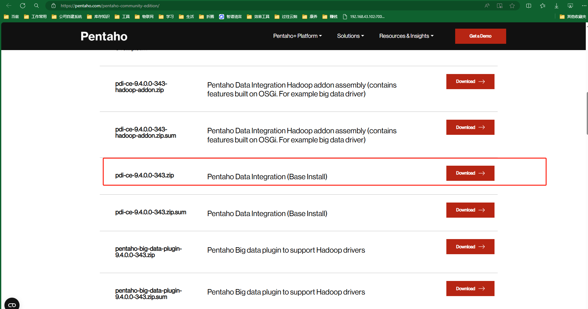
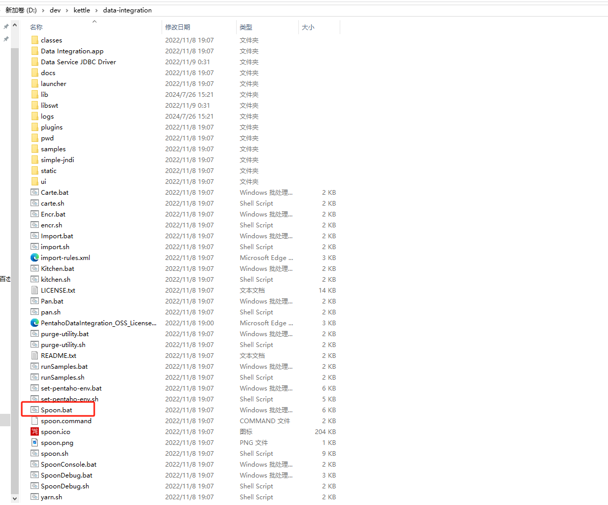
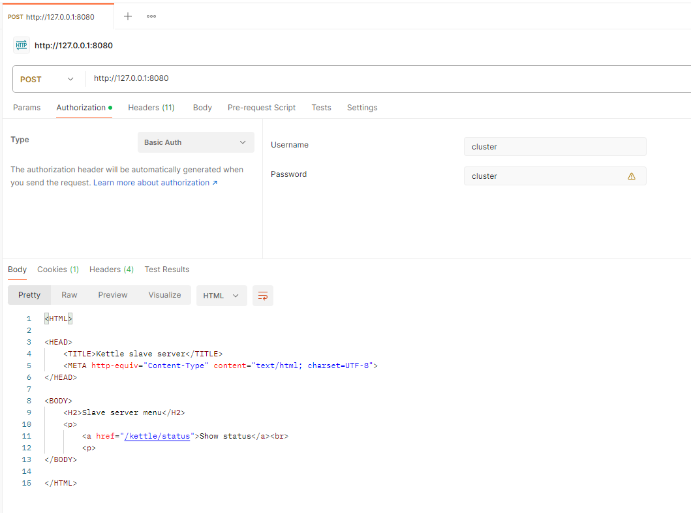
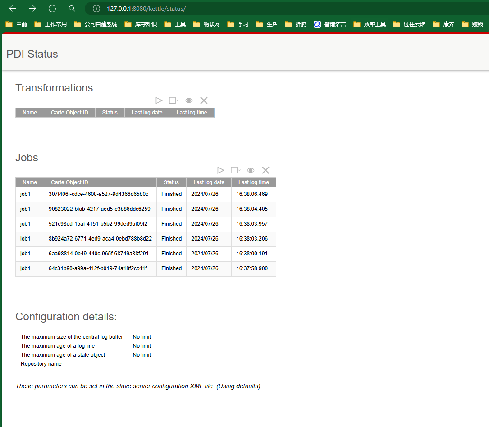

# 前言
- kettle已经更名为pdi， 所以在官网下载 pdi-ce 客户端，
- 当前版本为 9.4
- 下载地址为：https://www.hitachivantara.com/en-us/products/pentaho-platform/data-integration-analytics/pentaho-community-edition.html
- 

# 设计器 Spoon

解压文件

点击Spoon.bat启动设计界面

# 存储仓库
界面右上角，connect处管理

简单新建一个文件存储库

配置文件会修改 C:\Users\abc\.kettle

# 服务端模式 Carte
Carte.bat 为服务端程序
需命令行启动： 
- Carte 127.0.0.1 8080 
- Carte 127.0.0.1 8080 -s -u cluster -p cluster

使用的Basic认证， 默认账号密码都是 cluster

使用postman测试

参考：https://blog.csdn.net/Octopus21/article/details/115518944

# 接口
## 执行作业

http://127.0.0.1:8080/kettle/executeJob/?rep=test-repo&user=cluster&pass=cluster&job=job1

结果

